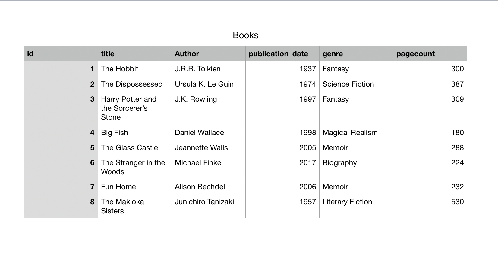
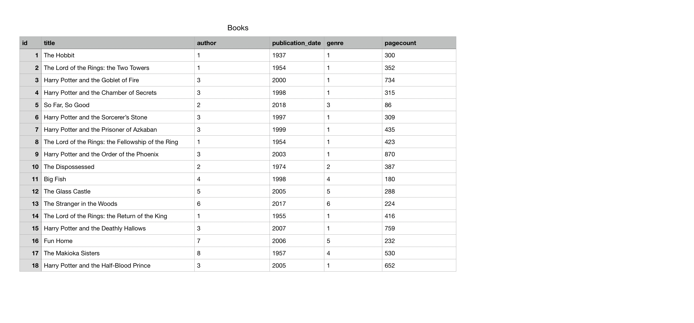
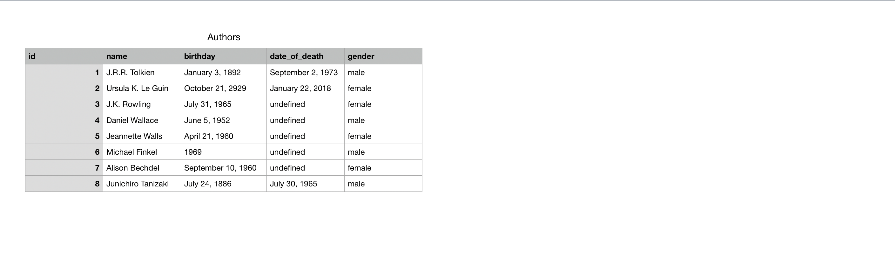
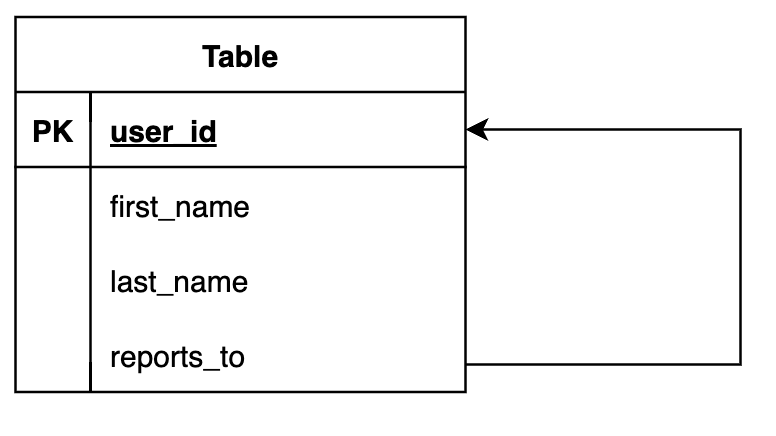

# Introduction to SQL and PostgreSQL

## What is PostgreSQL?

PostgreSQL is a relational database system.

A **Relational Database** stores _uniformly structured_ data that have relationships to other data in the database. We're going to begin today by focusing on the _uniformly structured_ portion before we dive into the _relational_ portion of the database.

### Tables and Rows

Data in a relational database is stored in _tables_ and _rows_, where a **table** represents a type of data and a **row** represents an individual entry in a table. You can think of this exactly like an Excel spreadsheet or Google Sheet.

Consider, for example, a library database. It would make sense that we'd want to track data about books, so there would be a table representing all of our books in this database. Now, the kind of data that we care about tracking is going to be the same for each book, but the values will be different. We'll probably care about:

- Title
- Author
- Publication date
- Genre
- Page count
- and potentially more

Each of these datapoints will be a **column** in our table, and for each _row_, we'll track all of the values for one specific book.



An important thing to understand, however, is that a database will typically include multiple tables representing different types of data. After all, our library database will probably contain information on other things related to books. It may contain:

An Authors table, potentially with:

- Name
- Birthday
- Date of death
- Gender identity

A Genres table, potentially with:

- Genre Name
- Location in the library

A Customers table, potentially with:

- Name
- Email
- Address
- Phone number
- Overdue fee

And potentially more!

### Relational Data

The thing that makes relational databases _relational_, however, is the fact that these tables can be _related_ to each other. Let's focus in on Books, Authors, and Genres for a moment.

A Book has a relationship with an Author. Specifically, a Book has _one_ Author and an Author might have written _many_ books (let's ignore books authored by multiple people for the moment). These tables exist in a _One-to-Many Relationship_.

Now why are these relationships important? Well, sometimes we may want to retrieve the data for a specific book. Sometimes we may want to retrieve data about a specific author. Sometimes, however, we may want to receive data for a specific author _and_ the data for all books _related_ to that author! This is where our relationships are going to come into play.

When defining the relationships between our tables, it's important to understand that there are three types of relationship:

- One-to-One: an Author and their Obituary exist in a One-to-One relationship
- One-to-Many: a Book has one Author and an Author can have written many Books
- Many-to-Many: a Book can be read by many Book Clubs and many Book Clubs and read the same Book

So tables can exist in relation to other tables, but to associate a specific entry (or row) to an entry in another table, we'll have to use _Primary Keys_ and _Foreign Keys_.

### Primary Keys and Foreign Keys

We need to _uniquely associate_ the tables that have relationships between them, otherwise we won't be able to know which row we're referring to. Think of our Authors: there are multiple authors named Terry Jones, so which one do we refer to?

The solution is to automatically give each row a unique identifier, typically an integer.

Each table will include a column that is the **Primary Key** for that table. This will be an identifier for which each entry has a _unique_ value. The most common Primary Key will be "id".

Tables that exist in relation to other tables will also include **Foreign Keys**. These are values that are meant to match with the Primary Key of a _foreign_ table, meaning a different table in the database. For example, a Book might have a value of 4 in its Author column instead of the name of its author. This is a Foreign Key that means that the book's author is whichever entry in the Authors table has a Primary Key of 4.

Below, I've modified our Books table from before and also added an Authors table and a Genres table. Take a look and see if you can match the Books to their Authors and Genres.






Currently, all of the relationships here are One-to-Many. A Book has one Author but an Author _can have written_ many books. That doesn't necessarily mean every author _has_ written many books (in fact some here only have one listed), but it is possible. Additionally, a Book has one Genre but a Genre _can include_ many books.

Sometimes it can be confusing as to which table should reference the other. After all, if Books and Authors are in an association, should the Books table include an Author column or should the Authors table include a Books column? Well, because each cell can only include one value, we're going to use whichever column would have a _singular_ value: "Author" vs "Books".

A good old imperialist example I like to use is King George and the Peasants. King George and the Peasants exist in a One-to-Many relationship: King George has many Peasants and the Peasants have one King. It's unrealistic to expect King George to remember the name of every single peasant that he rules. However, it's pretty likely that each peasant can remember the one king that rules them.

In the same way, our "One" can't keep track of the "Many" associated with it, but the "Many" can all remember the "One" that owns them.

## Step 1: Create a Table

_Note:_ This [Quick SQL Cheatsheet](https://github.com/enochtangg/quick-SQL-cheatsheet) is an excellent resource and you should definitely bookmark it.

Open the Query Tool in PgAdmin as shown in the [getting started guide](../README.md#get-set-up-with-pgadmin).

Our first task is to create a table. To do that, we use a command `CREATE TABLE`.

Our table will contain Users. Users will have an ID, a first name, and a last name. Create table queries follow the following syntax:

```sql
CREATE TABLE table_name (
    column_1 data_type constraints,
    column_2 data_type constraints,
    ...
)
```

<details>
<summary>Common SQL Data types</summary>
<br>

> - `INT` or `INTEGER` - A signed 4-byte number
> - `SERIAL` - An autoincrementing four-byte integer
> - `VARCHAR(n)` or `TEXT` - Stands for Varying Character, is a variable length character string
> - `BOOLEAN` or `BOOL` - A boolean (true/false) value
> - `DATE` - A calendar date with a year, month and day
> - `TIMESTAMP` - A date and time
>
> For more types, check out the [Postgres Data Type Docs](https://www.postgresql.org/docs/current/datatype.html)
>
</details>
<br>

<details>
<summary>Common Constraints</summary>
<br>

> - `NOT NULL` - States that a given column must not be null
> - `UNIQUE` - States that a given column, or group of columns, must be unique among all other rows in the table
> - `PRIMARY KEY` - The combination of `NOT NULl` and `UNIQUE`
> - `REFERENCES` - Helps define a foreign key constraint to a column in another table
>
> For more constraints, check out the [Postgres Data Constraint Docs](https://www.postgresql.org/docs/current/ddl-constraints.html)
>
</details>
<br>

```sql
CREATE TABLE users (
    user_id SERIAL PRIMARY KEY,
    first_name VARCHAR NOT NULL,
    last_name VARCHAR NOT NULL
);
```

Let's say we want to add a column for who reports to whom. We can do this with `ALTER TABLE`.

```sql
--- ALTER TABLE <table name> ADD COLUMN <column name> <data type> <constraints>;
ALTER TABLE users ADD COLUMN reports_to INTEGER;
```

### Knowledge Check

Notice that we are using an `INTEGER` for the `reports_to` column. Why?

<details>
<summary>Answer</summary>
<br/>

The value for `reports_to` will be the `user_id` of the respective user's manager.
The `user_id` should never change, but `first_name` and `last_name` can.
</details>
<br/>

Can `reports_to` be null?

<details>
<summary>Answer</summary>
<br/>

Yes. We did not add the `PRIMARY KEY` constraint (because we already have one) and we did not add a `NOT NULL` constraint.
</details>
<br/>



## Step 2: Create, Read, Update, and Delete Row Data

### Create a user

To create a user, we use `INSERT`.

```sql
--- INSERT INTO table(columns) VALUES (column values)
INSERT INTO users(first_name, last_name) VALUES ('John', 'Smith');
```

To see the results, we use `SELECT`.

```sql
--- SELECT columns FROM table;
--- * is a wildcard meaning return all columns.
SELECT * FROM users;
```

We should see something like this:

| `user_id` | `first_name` | `last_name` | `reports_to` |
| --------- | ------------ | ----------- | ------------ |
| `1`       | `John`       | `Smith`     | _null_       |

Notice that `user_id` has been populated automatically but `reports_to` has not.

To just see specific columns, we list them after `SELECT`. For example:

```sql
SELECT first_name, last_name FROM users;
```

returns:

| `first_name` | `last_name` |
| ------------ | ----------- |
| `John`       | `Smith`     |

Now let's create a user who reports to John.

```sql
--- INSERT INTO table(columns) VALUES (column values)
INSERT INTO users(first_name, last_name, reports_to) VALUES ('Matt', 'Jones', 1);
SELECT * from users;
```

### Update a user

John hires two more employees. Let's add them to the table.

```sql
INSERT INTO users(first_name, last_name, reports_to) VALUES ('Jennifer', 'Williams', 1);
SELECT * from users;
```

Jennifer says they prefer to use "Jenny" as their first name. We can update their first name using `UPDATE`.

```sql
--- UPDATE table SET column = value WHERE condition
UPDATE users SET first_name = 'Jenny' WHERE user_id = 3;
SELECT * from users;
```

<details>
<summary>What if I forgot Jenny's <code>user_id</code>? How do I update their name?</summary>
<br>

You can find out the `user_id` with another query.

```sql
-- Before the update query is run
SELECT user_id from users WHERE first_name = 'Jennifer' and last_name = 'Williams'
```

Now you can use this `user_id` in the `UPDATE` query written above.

</details>
<br>

### Delete a user

Matt wins the lottery and resigns. Let's remove him from the table.

```sql
--- DELETE FROM table WHERE condition
DELETE FROM users WHERE user_id = 2;
SELECT * from users;
```

Why are we using `user_id` as our condition?

<details>
<summary>Answer</summary>
<br/>

We only want to delete Matt from our table, so we use the ID because it is guaranteed to be unique and not null.

We can use any condition, however, and may delete multiple rows at once. `DELETE` should be used with caution!
</details>
<br/>

### Query Users

Add the following users to the table:

```sql
-- Note here how to quickly insert multiple rows in one INSERT query
INSERT INTO users (first_name, last_name, reports_to) VALUES ('Stacey', 'Milton', 1),
('Devan', 'Raines', 1),
('Andile', 'Perry', 1),
('Fumnanya', 'Giffard', 1),
('Derby', 'Travis', 3),
('Parker', 'Hudson', 3),
('Ola', 'Willis', 3),
('Kelechi', 'Warwick', 3),
('Cedar', 'Owston', 5),
('Avery', 'Ljungman', 5)
SELECT * from users;
```

_Note:_ Previously John's user ID was `2`. When we added more users, `2` was not reused.

Find all of John's direct reports.

```sql
--- Our condition is reports_to = 1 (John)
SELECT * FROM users WHERE reports_to = 1;
```

Find how many users report to Jenny.

To do this, we can use `COUNT()`.

```sql
SELECT COUNT(*) FROM users WHERE reports_to = 3;
```

### Update multiple users

Let's say Devan leaves the company. His direct reports will shift to Ola.

```sql
UPDATE users SET reports_to = ? WHERE reports_to = ?;
SELECT * FROM users;
```

<details>
<summary>Answer</summary>
<br/>

```sql
UPDATE users SET reports_to = 10 WHERE reports_to = 5;
SELECT * FROM users;
```

</details>
<br/>

## Step 3: Cleanup

To `TRUNCATE` our table means to leave the table structure in place and delete all of the rows.

```sql
--- TRUNCATE table;
TRUNCATE users;
SELECT * FROM users;
```

The table will be empty.

To `DROP` the table means to completely remove the table and its rows.

```sql
--- DROP TABLE table;
DROP TABLE users;
SELECT * FROM users;
```

Since we dropped the table, we'll get an error here.

```txt
ERROR:  relation "users" does not exist
```

### Knowledge Check

What would this row item look like as a JSON object?

| `user_id` | `first_name` | `last_name` | `reports_to` |
| --------- | ------------ | ----------- | ------------ |
| `1`       | `John`       | `Smith`     | _null_       |

<details>
<summary>Answer</summary>
<br/>

```json
{
    "user_id": 1,
    "first_name": "John",
    "last_name": "Smith",
    "reports_to": null
}
```

</details>

## Next Section

Next Section --> [2-Introduction-to-ExpressJS](../2-Introduction-to-ExpressJS/)
