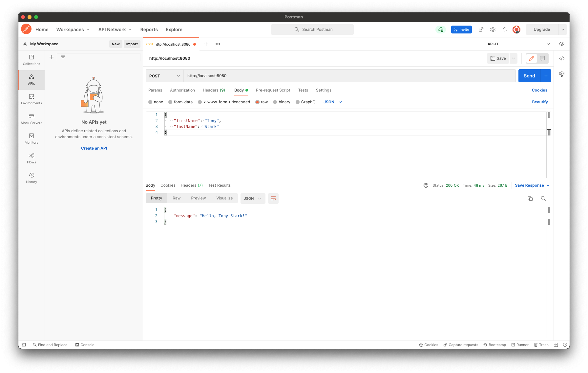

# Lab 2: NodeJS and Express

This lab will use [ExpressJS](https://expressjs.com/en/starter/installing.html), a web framework.

## What is Express?

Express is a web framework that we will be using today to build our REST Api. Express will be responsible for creating and handling our routes for specific paths and HTTP verbs.

For example, to handle a request for a `GET` request to the root `/` path, you could write the following code:

```js
const express = require("express");

const app = express()

app.get("/", (req, res) => {
  // Write code that we want to run when the client hits the /test path with a GET request
});
```

Let's break this down further!

## Step 1: Understanding and Running the Express App

Open Terminal (or Command Prompt) and change to the [starter-app directory](../starter-app/). We will be looking at the [index.js](../starter-app/index.js) file for the introduction to express. All the code in step 1 is already implemented in the starter app. This step is to understand a bit more about express and the starter code provided.

First we initialize an `express` object. This gives us an entrypoint into Express's functionality.

```javascript
const express = require("express");
```

We create an app (called `app`) that uses `express` with the default parameters.

```javascript
const app = express();
```

We create a *route* for the root path (`/`) and the HTTP method `GET`.

When someone calls the root path with a `GET` request (`GET /`) then we return the string `"Hello, world!"`.

```javascript
app.get("/", (req, res) => {
  res.send("Hello, world!");
});
```

### Breaking Down This Express Syntax

```js
app.get("/", (req, res) => {
  res.send("Hello, world!");
});
```

`app` is an express application that is an object. To learn more about this express application object, check out the [full documentation](https://expressjs.com/en/4x/api.html). This express application object contains a method called `get()` which is used to create a get request listener for our application.

The [`app.get(path, callback)`](https://expressjs.com/en/4x/api.html#app.get.method) method takes 2 parameters - The first is a string which represents the path, and the second is a callback function which will be invoked when the path and HTTP method is matched.

<details>
<summary>What is an HTTP method?</summary>
<br>

> An HTTP method is a way to annotate to an API what the intended action is for a given endpoint. Here are some common endpoints and their paired intended action:
>
> - GET - Get data
> - POST - Create data
> - PUT - Update data
> - DELETE - Delete data
>
</details>
<br>

The callback function takes two parameters - an [Express Request](https://expressjs.com/en/4x/api.html#req), and [Express Response](https://expressjs.com/en/4x/api.html#res). The request contains information about the request coming from the client such as path parameters, query parameters, headers, body (if the request is the appropriate HTTP verb to have a body), and more. The response is the object we will use to respond back to the client, often with the [`send()`](https://expressjs.com/en/4x/api.html#res.send), or [`json()`](https://expressjs.com/en/4x/api.html#res.json) methods.

```js
// A Sample callback function

function handleGetRoot(req, res) {
  // ignoring the req variable here for a simple example
  res.send("Hello, world!")
}

// Integrate the callback function into the GET / request

app.get("/", handleGetRoot)
```

The code block above where the callback function is broken out into its own `handleGetRoot` function has the same functionality as the initial code shown in this section where an anonymous arrow function was used to define the callback function.

### Continue Making The Express API

We create another *route* for a path with a parameter `name`. When someone calls `GET /{name}` then we return `"Hello, {name}!"`. Meaning, if a client sends a `GET /sample-name` request, the api would respond with `"Hello, sample-name"`

```javascript
app.get("/:name", (req, res) => {
    const name = req.params.name; // Get the name from the path parameter
    res.send(`Hello, ${name}!`); // Using a template string here to insert the name into the response
});
```

We define the port on which our server will run as `8080`.

```javascript
const PORT = 8080;
```

Finally, we start the server.

```javascript
app.listen(PORT, () => {
  console.log(`Server is running on port ${PORT}.`);
});
```

To start the server:

- Ensure your terminal is in the [starter-app folder](../starter-app/) which contains your `package.json` file.
- Run `npm install` to install the application dependencies.
- Run `node index.js` to start the server.

To use our endpoints, we can go to `http://localhost:8080/` in Postman or any web browser to send a GET request to the root endpoint.

## Step 2: Create Modules

Step 2 and moving forward, please code along with the guide.

For this basic example we have everything defined in `index.js`. In most cases we'll want to have an organized directory structure.

Create a folder `routes` and add a file `routes.js`. This will contain our `controllers` to define our route handlers. We will split up different base routes into different files in the `routes` directory. For example, all endpoints associated with the root `/` endpoint, will go in one file, but when we add the `/api/movies` route later on, this will go in another file in this folder.

Create a `root.routes.js` file in the `routes` folder and add the following code.

```javascript
// routes/root.routes.js
const router = require('express').Router();

// Hello world!
router.get(`/`, (req, res) => {
  res.send('Hello, world!');
});

// Hello name!
router.get(`/:name`, (req, res) => {
  res.send(`Hello, ${req.params.name}!`);
});

module.exports = router;
```

To integrate this new router into the app, replace the routes in the `index.js` file with the router.

```js
// index.js
const express = require('express');
const app = express();

// Replace the existing routes by importing the routes file and using it in the app.
const rootRouter = require('./routes/root.routes');
app.use('/', rootRouter);

const PORT = 8080;
app.listen(PORT, () => {
  console.log(`Server is running on port ${PORT}.`);
});
```

## Step 3: Create a POST Endpoint

We want to create a `POST /` endpoint that accepts a JSON request:

```json
{
    "firstName": "string",
    "lastName": "string"
}
```

and returns

```json
{
    "message": "Hello, {firstName} {lastName}!"
}
```

To do this, we can define a `POST /` route in `root.routes.js`:

```javascript
// root.routes.js

// Hello post
router.post(`/`, (req, res) => {
  const firstName = req.body.firstName;
  const lastName = req.body.lastName;
  res.json({ message: `Hello, ${firstName} ${lastName}!` });
});
```

### Sending a POST request to an API

To send a POST request, we will use a tool called [Postman](https://www.postman.com/). Open Postman and create a new request by pressing the `+` button on the top tab bar.


To set up a this post request, follow these steps using the image below for assistance:

1. Set the request type to be `POST`.
2. Type in the url you want to send the request to. In this case, our API is running on port `8080` on your computer, so the url would be `http://localhost:8080`.
3. Since we want to send a body with the POST request, we select the `Body` tab.
4. We want to send the body of our request as type `JSON`. Select the `raw` radio button and then `JSON` from the dropdown in the body portion of the request.
5. Create the body of your request. Please keep in mind that syntax matters in the body, meaning, `{}` braces are needed, `""` double quotes are needed, and capitalization matters. Please create the body exactly as shown.

    ```json
    {
        "firstName": "Tony",
        "lastName": "Stark"
    }
    ```

6. Once this is all set up, you can send the request with the Send button.


When we try the request, we get an error:


That's because, to handle a request body, we need to add a JSON parser to `index.js`.

The code below allows express to translate the incoming body of the POST request into a json object that can be referenced as the `body` property on the request object.

```javascript
//index.js

const express = require("express");
const app = express();

// use parser (must come before routes)
app.use(express.json());

const rootRouter = require('./routes/root.routes');
app.use('/', rootRouter);

const PORT = process.env.PORT || 8080;

app.listen(PORT, () => {
  console.log(`Server is running on port ${PORT}.`);
});
```

Retrying, you should get a successful response:



<details>
<summary>Our API code at this point in the code along</summary>
<br>

```js
// index.js
// import Express
const express = require('express');

// Create an Express app
const app = express();

app.use(express.json());

const rootRouter = require('./routes/root.routes');
app.use('/', rootRouter);

// Define the server port to 8080
const PORT = 8080;

// Start the server
app.listen(PORT, () => {
  console.log(`Server is running on port ${PORT}.`);
});
```

```js
// routes/root.routes.js
const router = require('express').Router();

// Hello world!
router.get(`/`, (req, res) => {
  res.send('Hello, world!');
});

// Hello name!
router.get(`/:name`, (req, res) => {
  res.send(`Hello, ${req.params.name}!`);
});

router.post(`/`, (req, res) => {
  const firstName = req.body.firstName;
  const lastName = req.body.lastName;
  res.json({ message: `Hello, ${firstName} ${lastName}!` });
});

module.exports = router;
```

</details>
<br>

Next Section --> [3-Creating-Movie-Api](./../3-Creating-Movie-Api/)
