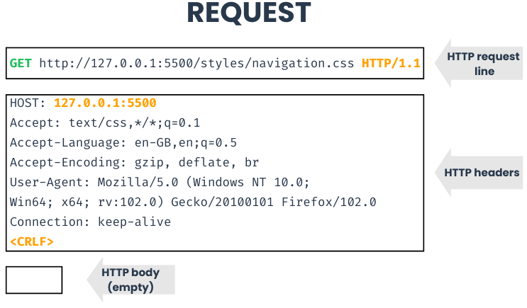
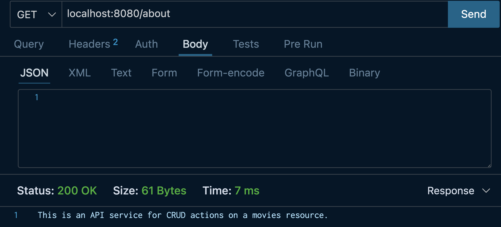

# ExpressJS

This content will explore [ExpressJS](https://expressjs.com/en/starter/installing.html) (sometimes just known as *Express*), a Node-based web framework that allows us to create server logic. 

We will use the Express web framework to build our RESTful API for an application that let's you view a list of movies from a server. Express will let us create our application logic to handle what our application should do depending on what HTTP requests are made to which endpoints.

For example, to handle a request for a `GET` request to the root `/` path of a server instance that responds with a JSON message, you could write the following code:

```js
// import express module
const express = require("express");

const PORT = 9000;

// declare variable as an instance of an express server
const app = express()

app.get("/", (req, res) => {res.json({message: "abc"})});

app.listen(PORT, () => {
  console.log(`Server is running on port ${PORT}.`);
});
```

An HTTP request will be sent out to an API whenever a user interacts with it. A request will often have data associated with it attached in the form of a *request body* and *request header*. The *request line* includes where the request is being sent to as well as which HTTP verb.

 

We'll be using Thunder Client, a VS Code extension, to make requests to the server's API for debugging and testing purposes.


## Running An Express App

Open your terminal and change directories to [starter-movies-api](../reference/starter-movies-api/). We will be looking at the [index.js](../reference/starter-movies-api/index.js) file for the introduction to Express. All the code in first step is already implemented in the starter app code. This step is to understand a bit more about Express and the starter code provided.

First we initialize an `express` object. This gives us an entrypoint into Express's functionality.

```javascript
const express = require("express");
```

We create an app (called `app`) that uses `express` with the default parameters.

```javascript
const app = express();
```

Now we specify a variable for the port number our application will run on when we start it.

```js
const PORT = 8080;
```

We then create a *route* for the path (`/about`) for the `GET` HTTP method.

When someone sends a `GET` request to the *about* path (`GET /about`) then we return a string detailing our API.

```javascript
// about our API
app.get("/about", (req, res) => {
	res.send("This is an API service for CRUD actions on movies resources.");
});
```

Finally, the code to run the server.

```javascript
app.listen(PORT, () => {
  console.log(`Server is running on port ${PORT}.`);
});
```

## Breaking Down This Express Syntax

Let's take a deeper dive into the Express syntax...

```js
// about our API
app.get("/about", (req, res) => {
	res.send("This is an API service for CRUD actions on movies resources.");
});
```

`app` is an Express application that is an object. To learn more about this Express application object, check out the [full documentation](https://expressjs.com/en/4x/api.html). This Express application object contains a method called `get()` which is used to create a get request listener for our application.

The [`app.get(path, callback)`](https://expressjs.com/en/4x/api.html#app.get.method) method takes 2 parameters - The first is a string which represents the path, and the second is a callback function which will be invoked when the path and HTTP method is matched.

<details>
<summary>What is an HTTP method?</summary>
<br>

> An HTTP method is a way to annotate to an API what the intended action is for a given endpoint. Here are some common endpoints and their paired intended action:
>
> - GET - Get data
> - POST - Create data
> - PUT - Update data
> - DELETE - Delete data
>
</details>
<br>

The callback function takes two parameters - an [Express Request](https://expressjs.com/en/4x/api.html#req), and [Express Response](https://expressjs.com/en/4x/api.html#res). The request contains information about the request coming from the client such as path parameters, query parameters, headers, body (if the request is the appropriate HTTP verb to have a body), and more. The response is the object we will use to respond back to the client, often with the [`send()`](https://expressjs.com/en/4x/api.html#res.send), or [`json()`](https://expressjs.com/en/4x/api.html#res.json) methods.

Here is an example of defining a function to use as a callback instead of writing the code inline could look:

```js
// A Sample callback function

function handleAboutPath(req, res) {
  // ignoring the req variable here for a simple example
	res.send("This is an API service for CRUD actions on movies resources.");
}

// Integrate the callback function into the GET / request

app.get("/about", handleAboutPath)
```

The code block above where the callback function is broken out into its own `handleAboutPath` function has the same functionality as the initial code shown in this section where an anonymous arrow function was used to define the callback function.

## Continue Making The Express API

Upon cloning the repo one route (`/about`) will already be in place for our Express application's API.

To start the server:

- Ensure your terminal is in the [starter-movies-api](../reference/starter-movies-api/) which contains your `package.json` file.
- Run `npm install` to install the application dependencies.
- Run `npm run start:dev` to start the server.

To actually access our current endpoint, we can go to `http://localhost:8080/about` in any web browser to send a GET request to the root endpoint `/about`.

Your response should look like:

 

Now we will create another *route* endpoint that uses parameters to take in dynamic values from the URL provided whenever it is called. For a path with a parameter `name`, when someone calls `GET about/{name}` we are going to return an about string value that uses the name variable. So if a client sends a `GET /about/sample-name` request, the API would respond with `"This is an API service for CRUD actions on a movies resource...for you, sample-name"`

***index.js***

```javascript
// the {name} value is dynamic based on the URL provided.
app.get("/about/:name", (req, res) => {
	const name = req.params.name;
	res.send(
		"This is an API service for CRUD actions on a movies resource...for you, " +
			name
	);
});
```

<details>
<summary>Our API code at this point in the code along</summary>
<br>

***index.js***


```js
const express = require("express");
const app = express();
const PORT = 8080;

// about our API
app.get("/about", (req, res) => {
	res.send("This is an API service for CRUD actions on movies resources.");
});

// the {name} value is dynamic based on the URL provided.
app.get("/about/:name", (req, res) => {
	const name = req.params.name;
	res.send("This is an API service for CRUD actions on a movies resource...for you " + name);
});

app.listen(PORT, () => {
	console.log(`Server is running on port ${PORT}.`);
});

```

</details>
<br>
 
Next Section --> [3-Creating-Movie-Api](./../3-creating-movie-api/README.md)
