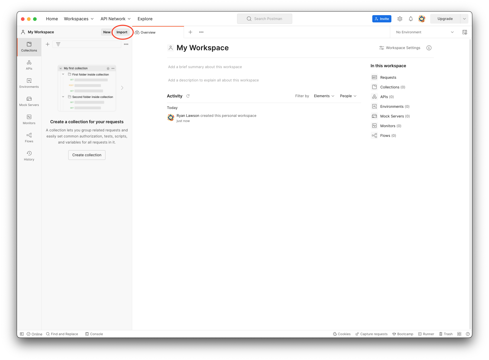
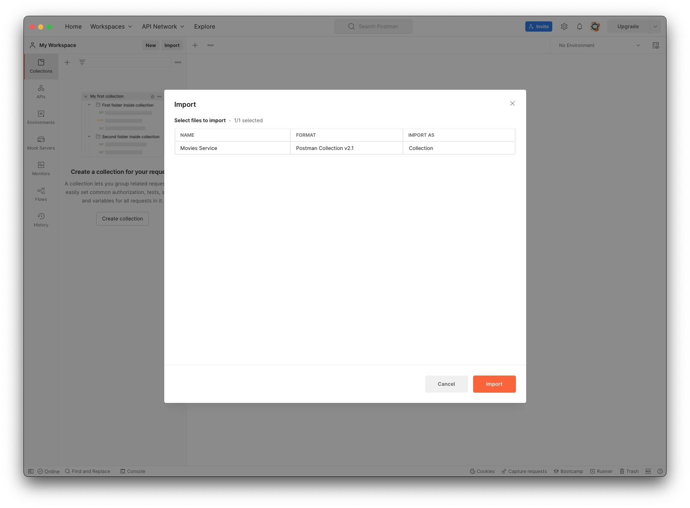
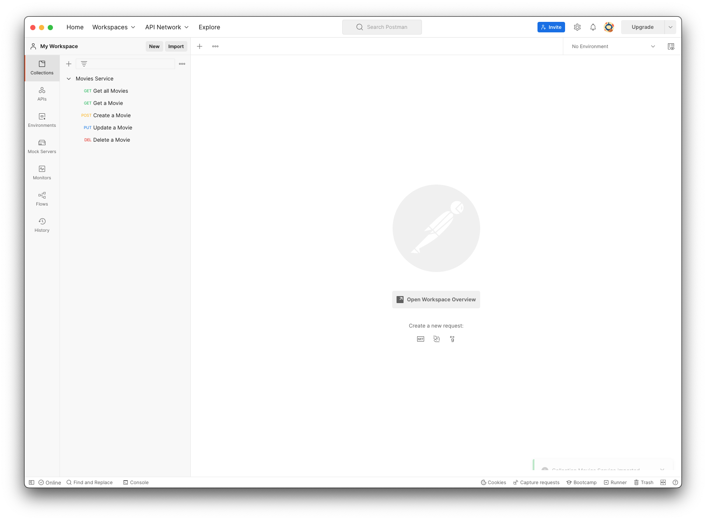

# Lab 3: Movies Service

This lab will expand on the basic ExpressJS API we have already created in [Lab 2](./../2-Introduction-to-ExpressJS). We will implement the following features to create the Movie Service:

- Plan and Create a Database to hold Movie info
- Plan and Implement a full CRUD (Create, Read, Update, Delete) API to interact with the Movie Database

## Planning the Movies Service

The next couple of steps are things that should be prepped before actually writing any code. This way, we have a plan and a final state to build toward when writing the code, rather than making it up as we go.

### Model

The Movie model is defining what properties the Movie object will have. This can relate to keys in a Javascript object, columns in a database, or anywhere we see a Movie in this application.

A Movie object has the following fields:

| Field       | Type     | Description                                    |
| ----------- | -------- | ---------------------------------------------- |
| `id`        | `string` | A UUID for the movie (automatically generated) |
| `name`      | `string` | Name of the movie                              |
| `genre`     | `string` | Movie genre                                    |
| `img`       | `string` | URL to a movie poster image                    |
| `updatedAt` | `string` | Updated timestamp (automatically generated)    |
| `createdAt` | `string` | Creation timestamp (automatically generated)   |

Example:

```json
{
    "id": "630e28f8-0048-41f3-833a-dc0657309f0b",
    "name": "Dune",
    "genre": "Science Fiction",
    "img": "https://m.media-amazon.com/images/M/MV5BN2FjNmEyNWMtYzM0ZS00NjIyLTg5YzYtYThlMGVjNzE1OGViXkEyXkFqcGdeQXVyMTkxNjUyNQ@@._V1_FMjpg_UX1000_.jpg",
    "updatedAt": "2021-12-17T18:55:47.053Z",
    "createdAt": "2021-12-17T18:55:47.053Z"
}
```

## Endpoint Planning

The following endpoints follow a full CRUD (Create, Read, Update, Delete) model when creating an API. The Movies service will be an api that allows clients to interact with the movie information that is saved in the database. Therefore, we will create endpoints that allow the user to Create, Read, Update and Delete movies that are in the database.

### Get all movies

**Request:**

```txt
GET /api/movies
```

**Response:**

```txt
200 OK
Movie[]
```

### Get a particular movie by ID

```txt
GET /api/movies/{id}
```

**Response:**

Successful

```txt
200 OK
Movie
```

Movie not found

```txt
404 Not Found
```

### Add a new movie

**Request:**

```txt
POST /api/movies

Body
{
    "name": "string",
    "genre": "string",
    "img": "string"
}
```

**Response:**

```txt
201 Created
Movie
```

### Update a movie

**Request:**

```txt
PUT /api/movies/{id}

Body
{
    "name": "string",
    "genre": "string",
    "img": "string"
}
```

**Response:**

```txt
200 OK

{
    "message": "string"
}
```

### Delete a movie

**Request:**

```txt
DELETE /api/movies/{id}
```

**Response:**

```txt
200 OK

{
    "message": "string"
}
```

## Set Up Postman

Postman will be our client (the application that sends requests) to test our API while we are building it. In this folder, there is a `Movies Service.postman_collection.json` file which contains the configuration for sending the requests that this API will handle.

1. Import the Postman collection for Movies Service (`Movies Service.postman_collection.json`).

    1. Select *Import* at the top of the Postman window.

        

    2. Select `Movies Service.postman_collection.json` and select *Import*.

        

    3. You'll see the imported collection on the left.

        

## Preparing Postgres

For this application, we will use the default database created when postgres is installed. If you would like to create a new database, you may, but this is not necessary.

To get ready for the movies service, we first have to create a table and the appropriate columns. Open the Query Tool in PgAdmin and run the following query to create your `movie` table.

```sql
CREATE TABLE movie (
    id TEXT PRIMARY KEY,
    name TEXT,
    genre TEXT,
    img TEXT
);
```

Next we will add sample data to the database. Run the following `INSERT` query:

```sql
INSERT INTO movie (id, name, genre, img)
VALUES ('1aff8b8a-f977-428a-8cd1-ef44f189566c', 'Dune', 'Science Fiction', 'https://m.media-amazon.com/images/M/MV5BN2FjNmEyNWMtYzM0ZS00NjIyLTg5YzYtYThlMGVjNzE1OGViXkEyXkFqcGdeQXVyMTkxNjUyNQ@@._V1_FMjpg_UX1000_.jpg'),
('22f042c9-79e1-4f4d-8fa0-dafc74b8b69f', 'Free Guy', 'Comedy', 'https://m.media-amazon.com/images/M/MV5BOTY2NzFjODctOWUzMC00MGZhLTlhNjMtM2Y2ODBiNGY1ZWRiXkEyXkFqcGdeQXVyMDM2NDM2MQ@@._V1_.jpg'),
('9321bd2b-f8e4-49d3-9ac4-3fb8b4be9cc6', 'Eternals', 'Science Fiction', 'https://m.media-amazon.com/images/M/MV5BMTExZmVjY2ItYTAzYi00MDdlLWFlOWItNTJhMDRjMzQ5ZGY0XkEyXkFqcGdeQXVyODIyOTEyMzY@._V1_.jpg');
```

## Set Up CORS

Cross-Origin Resource Sharing is way to define which origins other than its own from which a browser should be able to access data from. In other words, if I send a request from `google.com`, CORS will only allows responses that are send from google.com. In reality, the front end, and back end may be on different origins. To combat this, we implement CORS on the backend to allow different origins to access the data from our API. Check out the [MDN web docs](https://developer.mozilla.org/en-US/docs/Web/HTTP/CORS) for more info on CORS.

To implement, first install the `cors` npm plug in with the following command:

```zsh
npm install cors
```

Then, add the following configuration in `index.js`

```js
// index.js

const cors = require('cors')
app.use(cors())
```

## Connecting to Postgres

In [section 1](../1-Introduction-to-SQL-and-PostgreSQL/) of this workshop, SQL queries were ran using the PgAdmin Query tool. Now we want to be able to run SQL queries in our Express API. To do this, we will use the [KnexJs library](https://knexjs.org/). Knex (pronounced [/kəˈnɛks/](https://youtu.be/19Av0Lxml-I?t=521)) is a SQL builder for Node.

### Install Knex

Open your terminal and make sure you are in the `starter-app` folder where you are working on your code along. Run the following command:

```zsh
npm install knex pg
```

This command will update the `dependencies` section of the `package.json` file and install the libraries needed into the `node_modules` folder.

### Creating the connection object

Just as we did in PgAdmin, we need to supply connection information for the database to connect to. If you forget your connection config, check out the suggestions in the [Postgres Set Up](../README.md#ensure-postgres-is-running) for your given operating system.

To integrate this into our application, create a folder called `config` and add a `db.config.js` file to that folder.

```js
// config/db.config.js

module.exports = {
  client: 'pg',
  connection: {
    host: 'localhost',
    port: 5432,
    user: 'your_database_user',
    password: 'your_database_password',
    database: 'your_database_name',
  },
};
```

To make the connection, we use this configuration with `knex`. Create a `db` folder and a file called `movies.js`. This file will create a db connection and then have all the appropriate functions to query the db.

```js
// db/movies.js

const knex = require('knex');
const config = require('../config/db.config');

const db = knex(config); // Creates the database connection
```

### Writing Queries

To implement the endpoints planned for above, we will need to create the following functions:

- `getAllMovies`
- `getMovieById`
- `createMovie`
- `updateMovie`
- `deleteMovie`

First, think about the SQL queries to accomplish these goals, then implement them in Javascript by using knex.

#### `getAllMovies`

SQL:

```sql
SELECT * FROM movie;
```

To implement this in Javascript, knex offers two main tools.

1. Use raw queries

    ```js
    db.raw('SELECT * FROM movie;')
    ```

1. Use the knex query builder

    ```js
    db.select('*').from('movie')
    ```

While the raw queries will work, using the knex query builder is the recommended approach. The query builder syntax allows you to write your queries in a more code-like fashion and is the true power behind the knex library. It also have some securities built in to help you avoid attacks like SQL injection.

Check out the [official documentation](https://knexjs.org/guide/query-builder.html) for more info on how to translate raw queries to the knex query builder.

```js
// db/movies.js

function getAllMovies() {
  return db.select('*').from('movie');
}
```

> Of note here, consider what JS type is being returned. Since the query to the database is an asynchronous action, this function will return a Promise that contains a list of movies - `Promise<Movie[]>`.

Using this strategy, we can create the rest of the db functions to satisfy the necessary queries.

#### `getMovieById`

SQL:

```sql
SELECT * from movie where id='myId';
```

Javascript:

```js
function getMovieById(movieId) {
  return db.select('*')
      .from('movie')
      .where({ id: movieId })
      .first(); // This selects one movie, rather than a list of one item.
}
```

#### createMovie

SQL:

```sql
INSERT INTO movie (id, name, genre, img)
VALUES ('myId', 'myName', 'myGenre', 'myImg');
```

Javascript:

```js
const { v4: uuidv4 } = require('uuid');

function createMovie(movie) {
  movie.id = uuidv4();
  return db.insert(movie)
      .into('movie')
      .returning('*'); // Returns the movie that was created
}
```

> Of note here, since new movies need an id, we need to create one. Here, we use the [uuid package](https://www.npmjs.com/package/uuid) to accomplish this. Make sure to install the uuid package by running the following command in your terminal.

```zsh
npm install uuid
```

#### updateMovie

SQL:

```sql
UPDATE movie
SET name='myName', genre='myGenre', img='myImg'
WHERE id='myId';
```

Javascript

```js
function updateMovie(movie) {
  return db('movie')
      .where({ id: movie.id })
      .update({
        name: movie.name,
        genre: movie.genre,
        img: movie.img,
      })
      .returning('*');
}
```

#### deleteMovie

SQL:

```sql
DELETE from movie where id='myId';
```

Javascript:

```js
function deleteMovie(movieId) {
  return db('movie')
      .where({ id: movieId })
      .del();
}
```

### Exporting Functions

Once all the functions are written, we just need to export then to be used elsewhere in the application.

```js
// db/movies.js

module.exports = {
  getAllMovies,
  getMovieById,
  createMovie,
  updateMovie,
  deleteMovie,
};
```

<details>
<summary>Completed <code>movies.js</code> file</summary>
<br>

```js
const knex = require('knex');
const config = require('../config/db.config');

const db = knex(config);

function getAllMovies() {
  return db.select('*').from('movie');
}

function getMovieById(movieId) {
  return db.select('*')
      .from('movie')
      .where({ id: movieId })
      .first();
}

function createMovie(movie) {
  movie.id = uuidv4();
  return db.insert(movie)
      .into('movie')
      .returning('*');
}

function updateMovie(movie) {
  return db('movie')
      .where({ id: movie.id })
      .update({
        name: movie.name,
        genre: movie.genre,
        img: movie.img,
      })
      .returning('*');
}

function deleteMovie(movieId) {
  return db('movie')
      .where({ id: movieId })
      .del();
}

module.exports = {
  getAllMovies,
  getMovieById,
  createMovie,
  updateMovie,
  deleteMovie,
};
```

</details>
<br>

## Create Movie Controller

To finish off the movies services, we now integrate the db functions just created into routes created by express. Based on the [endpoint planning](#endpoint-planning), we will create the following routes:

- `GET /api/movies` - Get all Movies
- `GET /api/movies/{id}` - Get Movie by id
- `POST /api/movies` - Create a Movie
- `PUT /api/movies/{id}` - Update a Movie
- `DELETE /api/movies/{id}` - Delete a Movie

To keep these routes organized, in your `routes` folder, create a file called `movies.routes.js`. All routes defined in this file will have the prefix `/api/movies`. Since they all have the same prefix, we do not need to specify it in this route controller, and instead we can define it in the `index.js` file when we link the router into the application.

### Set up the Movies router

Just as we had with the root router, this Movies router will start the same way by defining an express router and exporting it.

```js
//  movies.routes.js

const router = require('express').Router();

// Routes to be defined

module.exports = router;
```

### Get all Movies

To get all the movies form the db, we will use the `getAllMovies` function written in the `db/movies.js` file. First, import it at the top of the file.

```js
const { getAllMovies } = require('../db/movies');
```

Now write the route and invoke the function. Remember, the `getAllMovies` function returns a `Promise<Movie[]>`, so `.then()` is used to wait until the promise is resolved to get the `Movie[]`.

```js
// It is assumed the route prefix of /api/movies is pre-pended
// This integration will come in the index.js file after the router is completed
router.get('/', (req, res) => {
  getAllMovies().then((movies) => {
    res.json(movies);
  }).catch((err) => {
    res.status(500).json(err);
  });
});
```

### Get a Movie by Id

The rest of the routes will follow the same pattern.

1. Import the db function
2. Create the endpoint
3. Call the function
4. Send back the response with the data.

```js
router.get('/:id', (req, res) => {
  getMovieById(req.params.id).then((movie) => {
    if (movie) { // Accounts for no movie being returned
      res.json(movie);
    } else {
      res.status(404).json({ error: 'Movie not found' });
    }
  }).catch((err) => {
    res.status(500).json(err); // Accounts for any errors that occur in getMovieById
  });
});
```

### Create a Movie

```js
router.post('/', (req, res) => {
  const newMovie = {
    name: req.body.name,
    genre: req.body.genre,
    img: req.body.img,
  };
  createMovie(newMovie).then((movie) => {
    res.status(201).json({
      message: 'Movie created',
      movie,
    });
  }).catch((err) => {
    res.status(500).json(err);
  });
});
```

### Update a Movie

```js
router.put('/:id', (req, res) => {
  const updatedMovie = {
    id: req.params.id,
    name: req.body.name,
    genre: req.body.genre,
    img: req.body.img,
  };
  updateMovie(updatedMovie).then((movie) => {
    // updateMovie returns Promise<Movie[]> since that is what .returning('*') returns
    // Due to this, we check to see if one movie is returned to know if we found a movie with the given id
    if (movie.length === 1) {
      res.json(movie[0]);
    } else {
      res.status(404).json({ message: 'Movie not found' });
    }
  }).catch((err) => {
    res.status(500).json(err);
  });
});
```

### Delete a Movie

```js
router.delete('/:id', (req, res) => {
  deleteMovie(req.params.id).then((isDeleted) => {
    if (isDeleted === 1) {
      res.json({
        message: 'Movie deleted',
        id: req.params.id,
      });
    } else {
      res.status(404).json({
        error: 'Movie not found',
      });
    }
  }).catch((err) => {
    res.status(500).json(err);
  });
});
```

<details>
<summary>Completed <code>movies.routes.js</code></summary>
<br>

```js
const router = require('express').Router();
const { getAllMovies, getMovieById, createMovie, updateMovie, deleteMovie } = require('../db/movies');

router.get('/', (req, res) => {
  getAllMovies().then((movies) => {
    res.json(movies);
  }).catch((err) => {
    res.status(500).json(err);
  });
});

router.get('/:id', (req, res) => {
  getMovieById(req.params.id).then((movie) => {
    if (movie) {
      res.json(movie);
    } else {
      res.status(404).json({ error: 'Movie not found' });
    }
  }).catch((err) => {
    res.status(500).json(err);
  });
});

router.post('/', (req, res) => {
  const newMovie = {
    name: req.body.name,
    genre: req.body.genre,
    img: req.body.img,
  };
  createMovie(newMovie).then((movie) => {
    res.status(201).json({
      message: 'Movie created',
      movie,
    });
  }).catch((err) => {
    res.status(500).json(err);
  });
});

router.put('/:id', (req, res) => {
  const updatedMovie = {
    id: req.params.id,
    name: req.body.name,
    genre: req.body.genre,
    img: req.body.img,
  };
  updateMovie(updatedMovie).then((movie) => {
    if (movie.length === 1) {
      res.json(movie[0]);
    } else {
      res.status(404).json({ error: 'Movie not found' });
    }
  }).catch((err) => {
    res.status(500).json(err);
  });
});

router.delete('/:id', (req, res) => {
  deleteMovie(req.params.id).then((isDeleted) => {
    if (isDeleted === 1) {
      res.json({
        message: 'Movie deleted',
        id: req.params.id,
      });
    } else {
      res.status(404).json({
        error: 'Movie not found',
      });
    }
  }).catch((err) => {
    res.status(500).json(err);
  });
});

module.exports = router;
```

</details>
<br>

## Connect the Movies router to the app

Add in the appropriate middleware to connect the movie router to the express app. This is were the `/api/movies` prefix is added to the router.

```js
// index.js

const movieRouter = require('./routes/movies.routes');
app.use('/api/movies', movieRouter);
```

<details>
<summary>Completed <code>index.js</code></summary>
<br>

```js
const express = require('express');
const cors = require('cors')

const app = express();

app.use(cors())

app.use(express.json());

const rootRouter = require('./routes/root.routes');
app.use('/', rootRouter);

const movieRouter = require('./routes/movies.routes');
app.use('/api/movies', movieRouter);

const PORT = 8080;

app.listen(PORT, () => {
  console.log(`Server is running on port ${PORT}.`);
});
```

> Of note here - The root router is not required for the Movie Service, but you can keep it in the app anyway if you would like.

</details>
<br>

## Conclusion

Congrats on building the Movie Service! To test the service, you can use Postman to make sure all your endpoints are working as intended, then the api is ready to be integrated with the React app created in [React 101](https://github.com/Black-and-Hispanic-Tech-Summit/React-101). A step by step process to make this connection is shown in the [Full Stack Applied](https://github.com/Black-and-Hispanic-Tech-Summit/Full-Stack-Applied) repo.

## Resources

Cheat Sheet: <https://github.com/enochtangg/quick-SQL-cheatsheet>

Data Types: <https://www.postgresql.org/docs/14/datatype-numeric.html>
