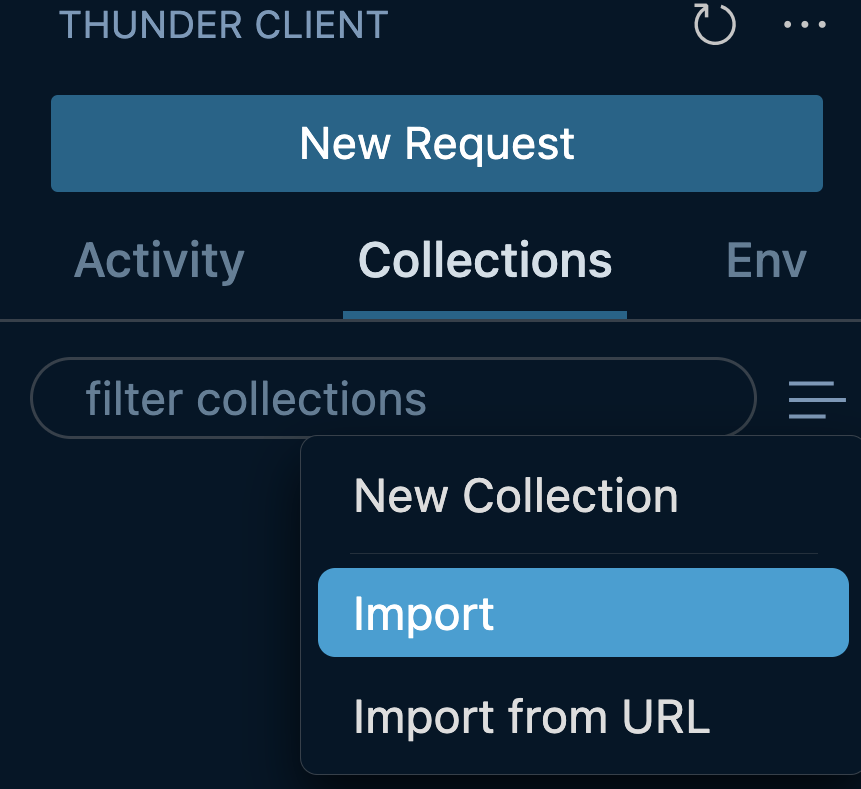
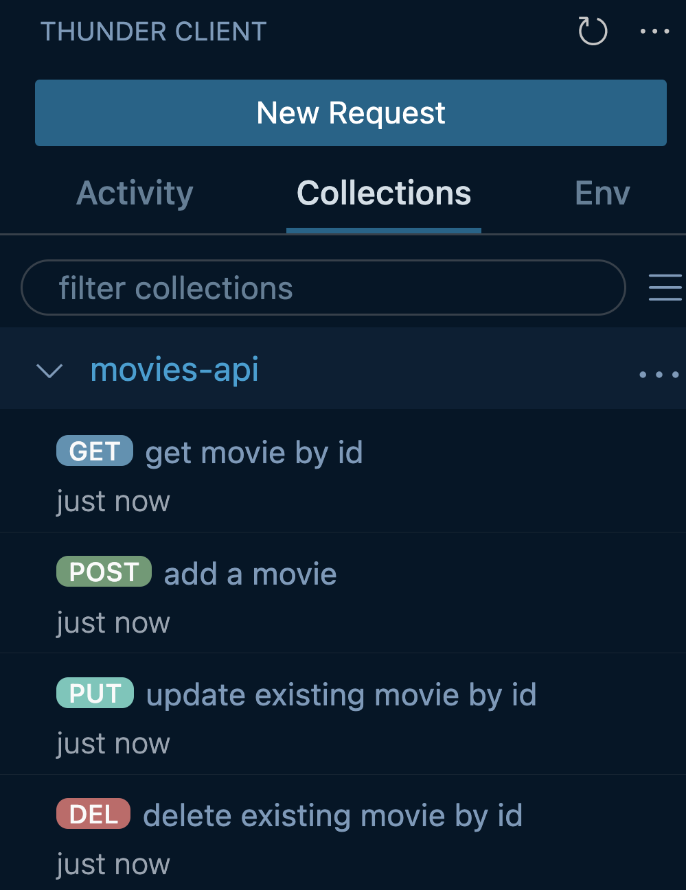

# Creating Movie API

To conclude we will expand on the [ExpressJS](./../2-intro-to-express) and [API concepts](./../1-apis) we learned so far to create a RESTful API.

We will build on our existing code which so far just has routes handling `/about` and `/about/:{whatever}`.

Ultimately we will make routes that handle requests to create, read, update and delete ***movie*** resources at endpoints we setup.

NOTE: You will often see these actions referred to as CRUD (create, read, update, delete) routes.

## Movie Model

Before we write any more code we should come up with an idea of how our data should look and behave. This allows us to have a clear idea of how the final state to build towards when writing the code rather than making it up as we go.

The movie resource in the context of our application will have a uniform structure for each individual movie. We achieve that by defining a *model*, a definition for the movie resource that outlines what properties each one will have.


A Movie can have the following fields as properties:

| Field       | Type     | Description                                    |
| ----------- | -------- | ---------------------------------------------- |
| `id`        | `string` | A unique identifier for the movie              |
| `name`      | `string` | Name of the movie                              |
| `genre`     | `string` | Movie genre                                    |
| `img`       | `string` | URL to a movie poster image                    |

We will take advantage of Javascript objects for how we store our movies on our server:

```json
{
    "id": "1",
    "name": "Dune",
    "genre": "Science Fiction",
    "img": "https://m.media-amazon.com/images/M/MV5BN2FjNmEyNWMtYzM0ZS00NjIyLTg5YzYtYThlMGVjNzE1OGViXkEyXkFqcGdeQXVyMTkxNjUyNQ@@._V1_FMjpg_UX1000_.jpg",
}
```

Our application has our data we need for movies in the ***data/MOVIES_STORE.js*** file.

## API Endpoints

A part of RESTful API design is your naming convention being uniform for resource endpoints.

The following endpoints follow a CRUD pattern when creating an API:

### Get All Movies

**Request:**

```txt
GET /movies
```

**Response:**

```txt
200 OK
Movie[]
```

### Get Movie By Id

```txt
GET /movies/{id}
```

**Response:**

Successful

```txt
200 OK
Movie
```

Movie not found

```txt
404 Not Found
```

### Add New Movie

**Request:**

```txt
POST /movies

Body
{
    "name": "string",
    "genre": "string",
    "img": "string"
}
```

**Response:**

```txt
201 Created
Movie
```

### Update Movie

**Request:**

```txt
PUT /movies/{id}

Body
{
    "name": "string",
    "genre": "string",
    "img": "string"
}
```

**Response:**

```txt
200 OK

{
    "message": "string"
}
```

### Delete Movie

**Request:**

```txt
DELETE /movies/{id}
```

**Response:**

```txt
200 OK

{
    "message": "string"
}
```

## Importing Thunder Client Collection

We can quickly setup the HTTP requests we want to use to help test our server code by importing the Thunder Client collection of requests from the JSON file [here](../reference/movies-api-collecition.json)

 

Here are the requests we will use to help debug our application:

 

## Setting Up CORS

Cross-Origin Resource Sharing is way to define which origins other than its own from which a browser should be able to access data from. In other words, if I send a request from `google.com`, CORS will only allows responses that are send from google.com. In reality, the frontend, and backend may be on different origins. To combat this, we implement CORS on the backend to allow different origins to access the data from our API. Check out the [MDN web docs](https://developer.mozilla.org/en-US/docs/Web/HTTP/CORS) for more info on CORS.

To implement, first install the `cors` package via terminal with the following command:

```zsh
npm install cors
```

Then, add the following configuration in `index.js`

```js
// index.js

const cors = require('cors');
app.use(cors());
```

This tells our server it is fine to accept requests from anywhere, including applications running on different servers/ports.

## Body Parser

We will also need to tell our application to handle incoming request bodies as JSON in our ***index.js*** using:

```js
app.use(express.json());
```

## Creating A Controller

A controller file contains the logic for the actions of we want to do to a resource. In this case our controller file will include logic for getting all movies, getting a movie by id, creating a new movie, updating a movie by id, and deleting a movie by id.

First create a folder `controllers` and then create a file `movies_controller.js` within it.

At the top we want to reference our actual movie data which is represented in the form of an array of JS objects:

***movies_controller.js*** 

At the top of the file we want to pull in our data where all our movie objects are stored:

```js
const MOVIES = require("../data/MOVIES_STORE");
```

And here is the remaining code for the CRUD actions:

```js
function getAllMovies() {
	return MOVIES;
}

function getMovieById(movieId) {
	const result = MOVIES.filter((movie) => movie.id == movieId);
	return result[0];
}

function createMovie(movie) {
	movie.id = MOVIES.length + 1;
	MOVIES.push(movie);
	return MOVIES[movie.id];
}

function updateMovieById(movieId, updatedMovie) {
	const index = MOVIES.findIndex(movie => movie.id === movieId);
	if (index > -1) {
		MOVIES[index] = updatedMovie;
		return updatedMovie;
	}

	throw new Error(`movie at id ${movieId} does not exist`);
}

function deleteMovieById(movieId) {
	const index = MOVIES.findIndex(movie => movie.id === movieId);

	if (index > -1 ) {
		return MOVIES.splice(index, 1)[0];
	}
	
	throw new Error(`movie at id ${movieId} does not exist`);
}

module.exports = {
	getAllMovies,
	getMovieById,
	createMovie,
	updateMovieById,
	deleteMovieById,
};
```

At the bottom our `module.exports` call allows these functions we just defined to be used in other JS files.

## Creating A Router

To finish off our Movies API, we'll integrate the actions from our controller file into a router file. A router in this case allows us to determine what code is ran whenever a HTTP request hits a specified endpoint. This approach let's us separate concerns in our code across multiple files and not stuff all of our potential route logic into one `index.js` file. Our router file will account for the following endpoints:

- `GET /movies` - Return all Movies
- `GET /movies/{id}` - Return a Movie by id
- `POST /movies` - Create a new Movie
- `PUT /movies/{id}` - Update an existing Movie by id
- `DELETE /movies/{id}` - Delete a Movie by id

### Path Parameters

You'll notice some of the endpoints we laid out are using square brackets `{example}` to note where these values will be dynamic. That value depends on the user's interaction when sending the HTTP request to our API. In our application's architecture every Movie will have an *id* associated with it so allow the user to specify a Movie by id in the request's path: 

- `GET http://localhost:8080/movies/3`
- `PUT http://localhost:8080/movies/2`
- `DELETE http://localhost:8080/movies/1`

Express let's you use *route parameters* which pull in values from the URL path with this syntax:

```js
app.get("/users/:userId", (req, res) => {
	res.json(req.params.userId);
})
```

The `:userId` part looks to capture that part of the string as a key-value pair in the request's `req.params` object.

So in this example a request `GET http://localhost:8080/users/22` would get response `22`.

## Continuing Our Router

To keep these routes organized create a `routes` folder and within it create a file `movies_routes.js`. All routes defined in this file will have the prefix `/movies`. Since they all have the same prefix, we do not need to specify it in this route controller, and instead we can define it in the `index.js` file when we link the router into the application.

In our router file we will reference our actions from our `movies_controller.js` file to be called at the appropriate endpoints:

```js
const router = require("express").Router();
const {
	getAllMovies,
	getMovieById,
	createMovie,
	deleteMovieById,
	updateMovieById,
} = require("../controllers/movies_controller");

router.get("/:id", (req, res) => {
	const movieId = Number(req.params.id);
	const movie = getMovieById(movieId);
	res.json(movie);
});

router.post("/", (req, res) => {
	const newMovie = {
		name: req.body.name,
		genre: req.body.genre,
		img: req.body.img,
	};

	createMovie(newMovie);
	res.status(201).json(newMovie);
});

router.put("/:id", (req, res) => {
	movieId = Number(req.params.id);
	const updatedMovie = {
		id: movieId,
		name: req.body.name,
		genre: req.body.genre,
		img: req.body.img,
	};
	updateMovieById(movieId, updatedMovie);
	res.json(updatedMovie);
});

router.delete("/:id", (req, res) => {
	movieId = Number(req.params.id);
	res.json(deleteMovieById(movieId));
});

module.exports = router;
```

Lastly we need to tell our main file (`index.js`) to bring the router file into our application by importing it before our `app.listen()` method.

***index.js***

```js
const express = require("express");
const app = express();
const PORT = 8080;
const cors = require('cors');

app.use(cors());
app.use(express.json());


// about our API
app.get("/about", (req, res) => {
	res.send("This is an API service for CRUD actions on movies resources.");
});

// the {name} value is dynamic based on the URL provided.
app.get("/about/:name", (req, res) => {
	const name = req.params.name;
	res.send(
		"This is an API service for CRUD actions on a movies resource...for you " +
			name
	);
});

const movieRouter = require('./routes/movies_routes');
app.use('/movies', movieRouter);

app.listen(PORT, () => {
	console.log(`Server is running on port ${PORT}.`);
});

```

## Conclusion

Congrats on building the Movie Service! To test the service, you can use Thunder Client to make sure all your endpoints are working as intended and that the api is ready to be integrated with the React app created in [React 101](https://github.com/Black-and-Hispanic-Tech-Summit/React-101). A step by step process to make this connection is shown in the [Full Stack Applied](https://github.com/Black-and-Hispanic-Tech-Summit/Full-Stack-Applied) repo.

You can view how you're final application's codebase [should look here](../reference/finished-movies-api/).
