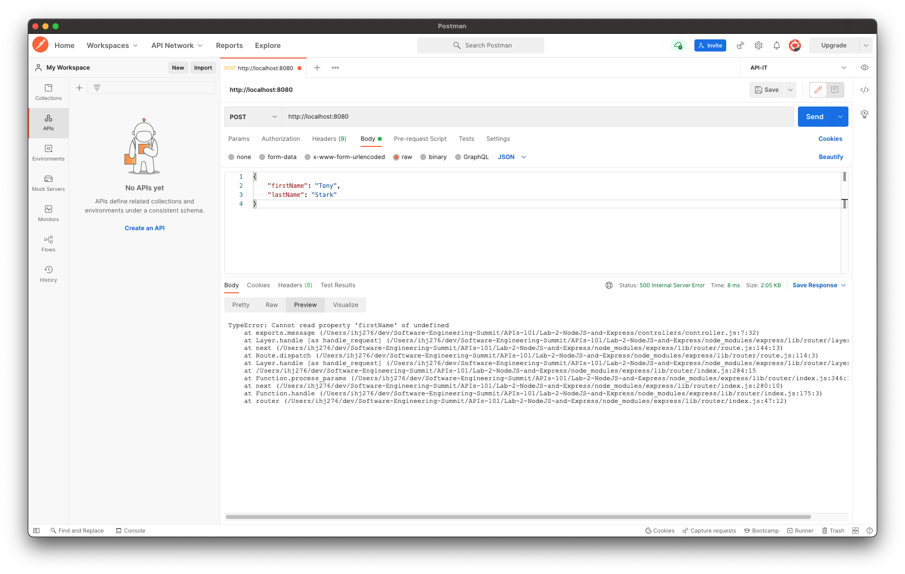

# Lab 2: NodeJS and Express

This lab will use [ExpressJS](https://expressjs.com/en/guide/routing.html), a web framework.

## Step 1: Run the Express App

Open Terminal (or Command Prompt) and change to this directory (`Lab-2-NodeJS-and-Express`).

Let's break down the application.

First we initialize an `express` object. This gives us an entrypoint into Express's functionality.

```javascript
const express = require("express");
```

We create an app (called `app`) that uses `express` with the default parameters.

```javascript
const app = express();
```

We create a *route* for the root path (`/`) and the HTTP method `GET`.

When someone calls the root path with a `GET` request (`GET /`) then we return the string `"Hello, world!"`.

```javascript
app.get("/", (req, res) => {
  res.send("Hello, world!");
});
```

We create another *route* for a path with a parameter `you`. When someone calls `GET /{you}` then we return `"Hello, {you}!"`.

```javascript
app.get("/:you", (req, res) => {
    res.send(`Hello, ${req.params.you}!`);
});
```

We define the port on which our server will run (can be defined with an environment variable `PORT` or defaults to `8080`).

```javascript
const PORT = process.env.PORT || 8080;
```

Finally, we start the server.

```javascript
app.listen(PORT, () => {
  console.log(`Server is running on port ${PORT}.`);
});
```

To start the server:

- Run `nvm use` to make sure you're using the correct NodeJS version.
- Run `npm install` to install the application dependencies.
- Run `node index.js` to start the server.

To use our endpoints, we can go to `http://localhost:8080/`.

## Step 2: Create Modules

For this basic example we have everything defined in `index.js`. In most cases we'll want to have an organized directory structure.

Create a folder `routes` and add a file `routes.js`. This will contain our endpoint logic:

```javascript
// routes/routes.js
module.exports = app => {
    const controller = require('../controllers/controller');
    const router = require('express').Router();

    // Hello world!
    router.get(`/`, controller.hello);

    // Hello you!
    router.get(`/:you`, controller.hello);

    app.use(`/`, router);
};
```

Create a folder `controllers` and add a file `controller.js`. This will contain our backend logic.

```javascript
// controllers/controller.js
exports.hello = (req, res) => {
    const you = req.params.you || 'world'
    res.send(`Hello, ${you}!`)
}
```

And now we can remove the endpoint definitions from `index.js`:

```javascript
// index.js
const express = require("express");
const app = express();

require('./routes/routes')(app)

const PORT = process.env.PORT || 8080;

app.listen(PORT, () => {
  console.log(`Server is running on port ${PORT}.`);
});
```

## Step 3: Create a POST Endpoint

We want to create a `POST /` endpoint that accepts a JSON request:

```json
{
    "firstName": "string",
    "lastName": "string"
}
```

and returns

```json
{
    "message": "Hello, {firstName} {lastName}!"
}
```

To do this, we can define a `POST /` route in `routes.js`:

```javascript
// Hello post
router.post(`/`, controller.message);
```

and define a function `message` in `controller.js` to handle the request:

```javascript
exports.message = (req, res) => {
    const firstName = req.body.firstName;
    const lastName = req.body.lastName;
    res.json({message: `Hello, ${firstName} ${lastName}!`})
};
```

When we try the request, we get an error:



That's because, to handle a request body, we need to add a JSON parser to `index.js`:

```javascript
const express = require("express");

// import parser
const bodyParser = require("body-parser");

const app = express();

// use parser (must come before routes)
app.use(bodyParser.json());

require('./routes/routes')(app)

const PORT = process.env.PORT || 8080;

app.listen(PORT, () => {
  console.log(`Server is running on port ${PORT}.`);
});
```

Retrying, you should get a successful response:


