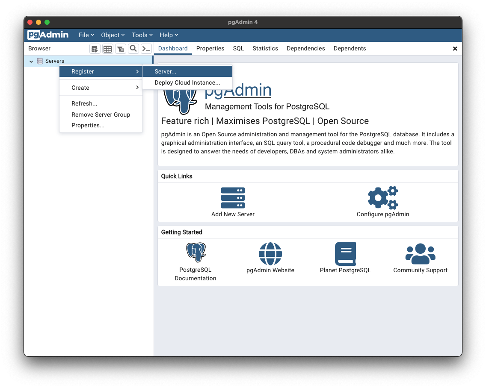
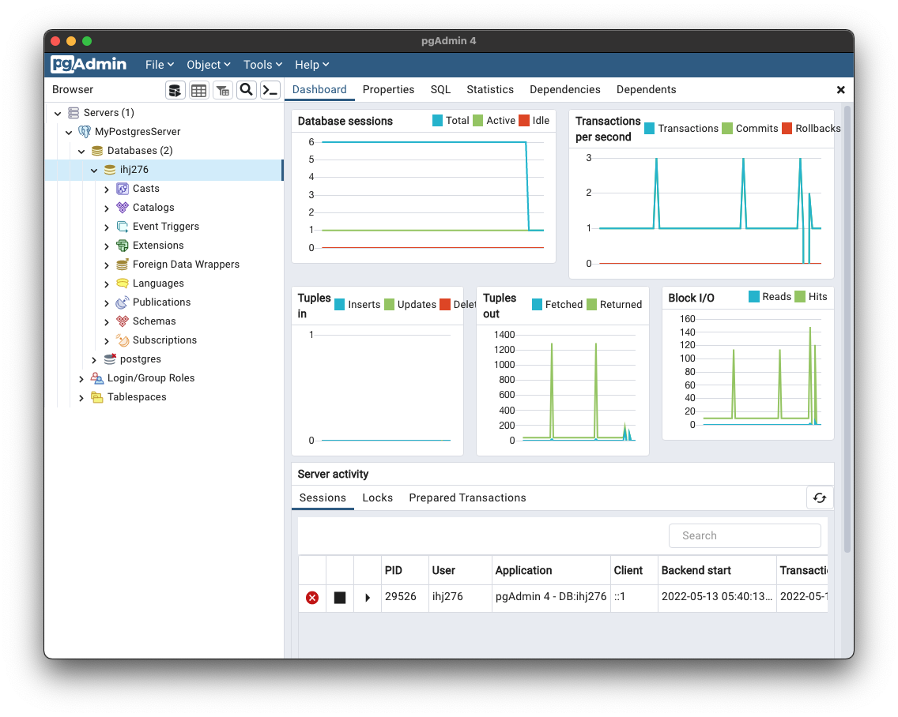
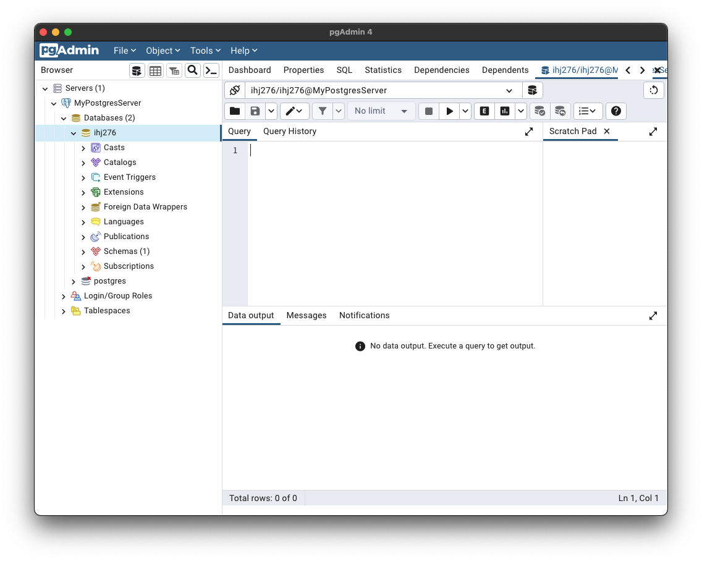
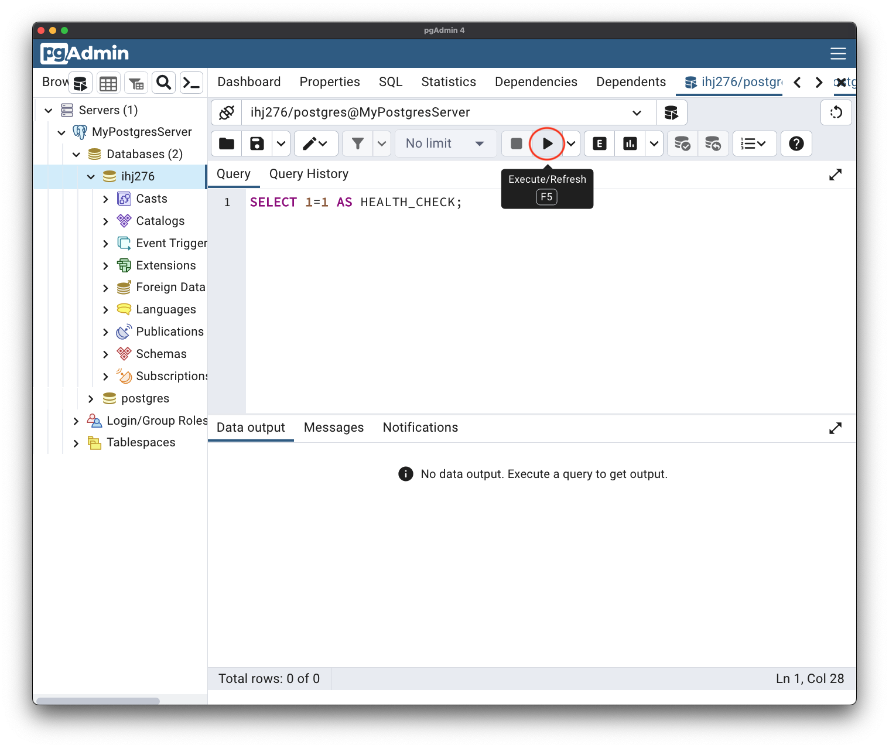
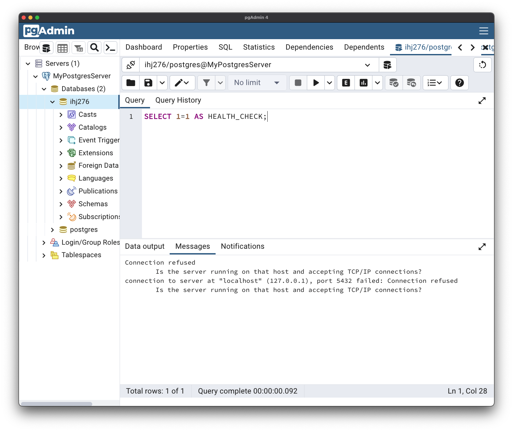
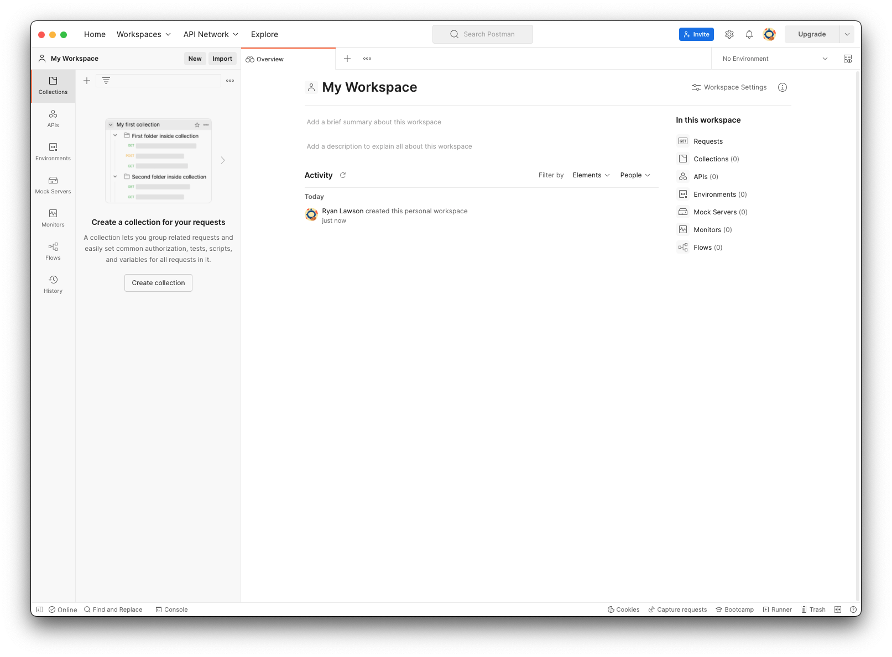

# APIs 101

During this workshop, we will cover the following topics:

1. [Getting Set Up](#getting-set-up)
1. [Introduction to SQL and PostgreSQL](./Introduction-to-SQL-and-PostgreSQL/)
1. [Introduction to ExpressJS](./Introduction-to-ExpressJS/)
1. [Creating a Movie API](./Creating-Movie-Api/) for our front end created from [React 101](https://github.com/Black-and-Hispanic-Tech-Summit/React-101)

## Getting Set Up

### Clone this repo

We will use `git` to download the repository to our local machine.

| Command           | Description                                                                                                    |
| ----------------- | -------------------------------------------------------------------------------------------------------------- |
| `git clone {url}` | Clone (download) a repository to your local machine.                                                           |
| `git pull`        | Download any changes made to the repository since you downloaded it. You must `cd` into the repository folder. |

So for example, to download this repository, we would run

```sh
git clone https://github.com/Black-and-Hispanic-Tech-Summit/APIs-101.git
cd APIs-101
```

### Ensure Postgres is running

<details>
<summary>macOS/Linux</summary>
<br>

1. Download [Postgres.app](https://postgresapp.com) and move it to your `Applications` folder.

1. Open *Postgres.app* and click on *Initialize* to start your server.

    

1. Click *Initialize*. After that you will see `Running` with a green checkmark.

    

1. The server is now running with the following default settings:

    - Host: `localhost`
    - Port: `5432`
    - User: *Your system username*
    - Database: *Your system username*
    - Password: *None*
    - Connection URL: `postgresql://localhost`

</details>
<br>

<details>
<summary>Windows</summary>
<br>

1. Go to [postgresql.org/download/windows](https://www.postgresql.org/download/windows/).

2. Click Download the installer in the Interactive installer by EDB section

3. Select the Windowsx86-64 option for the most recent version of Postgres 14

4. Run the installer with all default values

5. Feel free to install all selected values - PostgreSQL Server, pgAdmin 4, Stack Builder and Command Line Tools

6. When prompted to enter a password, we recommend using the password “postgres” for the super user as this is a typical value for local development.

7. When the install is finished, uncheck the Launch Stack Builder at exit box and finish.

8. Open Windows Service Manager and ensure the postgresql service is started

9. Your server will run with the following default settings:

    - Host: `localhost`
    - Port: `5432`
    - User: `postgres`
    - Database: `postgres`
    - Password: `postgres`
    - Connection URL: `postgresql://localhost`

</details>
<br>

### Get set up with PgAdmin

PgAdmin is used to run queries on our postgres database.

1. Download [PgAdmin](https://www.pgadmin.org/download/). Select the latest release for your platform.

1. Open *PgAdmin*.

    

1. Right-click *Servers* and select *Register > Server*.

    

1. Give your server a name (I name mine *MyPostgresServer*).

    

1. Enter the connection information from your PostgreSQL installation.

    

1. Click *Save*. You should now see your new server in the *Servers* list on the left.

    

1. For Lab 1 we will use the *Query Tool*. Click the *Query Tool* button (see below) to open it.

    

    

1. Type `SELECT 1=1 as HEALTH_CHECK` and press the Play button (&#9658;) to execute the query.

    

1. You should see `true` returned.

    

     If the server is *NOT* running, you'll see an error. Make sure the server is running.

     

### Get set up with Postman

Download [Postman](https://www.postman.com/downloads/) and open the app.


