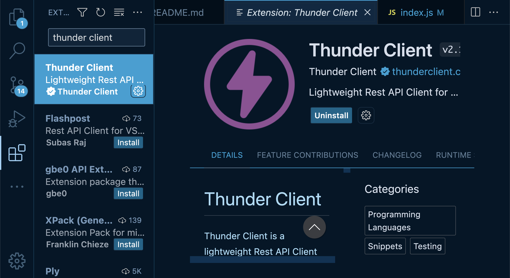

# Getting Set Up

## Cloning This Repo

We will use `git` to download the repository to our local machine.

| Command           | Description                                                                                                    |
| ----------------- | -------------------------------------------------------------------------------------------------------------- |
| `git clone {url}` | Clone (download) a repository to your local machine.                                                           |
| `git pull`        | Download any changes made to the repository since you downloaded it. You must `cd` into the repository folder. |

So for example, to download this repository, we would run

```sh
git clone https://github.com/Black-and-Hispanic-Tech-Summit/APIs-101.git
cd APIs-101
```

Download [Thunder Client](https://marketplace.visualstudio.com/items?itemName=rangav.vscode-thunder-client) extension.



When you are done setup you can start at [the apis section](./1-apis/README.md) to follow along.